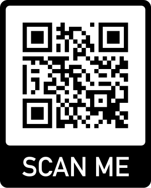

# Charity Finder App (React Native)

This is a Charity Finder App allows users to effortlessly discover charitable organizations from around the world by searching with keywords (eg "Pets", "Canada", "Africa", "W.H.O"). Users can easily mark their favorite organizations, access detailed information and location data, read descriptions, and enjoy real-time search capabilities for a seamless charity exploration experience. Additionally, users can make direct donations to support these organizations, contributing to their noble causes with just a few taps.

## Features

- Search Charities Globally.
- Favorite Organizations.
- Detailed Charity Info.
- Real-time Search.
- Simple Donations to Support Charities.
- Location Details.
- User-Friendly and Intuitive Interface.
- Screenshots and Demo Attached

## 🛠 Skills
React Native, Android and iOS

## QR Code
Install Expo from App Store or Play Store, Login and Scan QR to test the application.

  

## Demo

  
  
  
 

 
  
  

#### Video Demo:

[Video Link](https://gitlab.com/maz341/charity-finder/-/blob/main/assets/screenshots/recording.mp4)

## 🔗 Links

